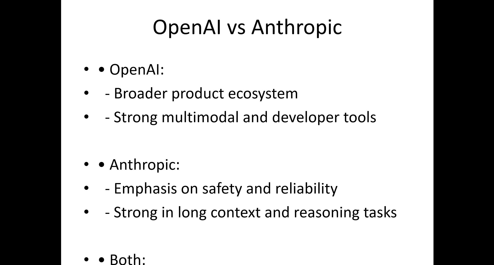
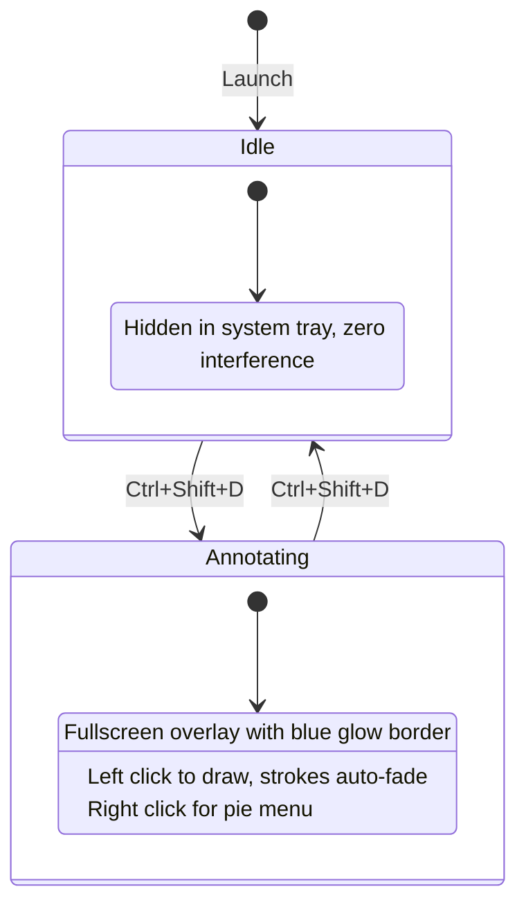

# FlashMark

**Draw. Fade. Focus.**

A lightweight screen annotation tool with auto-fading strokes. Built for remote meetings, teaching, and screen sharing.

<!-- TODO: Add a GIF demo here -->
<!--  -->

## Quick Start

1. **Download** `FlashMark.exe` from [Releases](https://github.com/lchaoer/flashmark/releases) (38MB, no install needed)
2. **Launch** — double-click, FlashMark hides in your system tray
3. **Annotate** — press `Ctrl+Shift+D`, draw on screen, press again to exit

That's it. No setup, no config, no dependencies.

## Use Cases

| Scenario | How FlashMark helps |
|----------|-------------------|
| **Remote meetings** | Circle key data points, draw arrows to guide attention — strokes fade so your screen stays clean |
| **Teaching & demos** | Annotate live code, diagrams, or slides without switching apps |
| **Code reviews** | Highlight lines, draw connections between components during screen share |
| **Presentations** | Emphasize slides in real-time, annotations disappear before the next topic |
| **Bug reports** | Quickly mark UI issues on screen while walking through reproduction steps |

## Why FlashMark?

Most annotation tools are designed for **screenshots** — you take a snapshot, mark it up, save it. FlashMark is designed for **live screen** — you draw directly on your desktop in real-time.

| | Traditional tools | FlashMark |
|---|---|---|
| **Workflow** | Screenshot → annotate → share | Draw directly on screen |
| **Persistence** | Annotations stay forever | Auto-fade after 3 seconds |
| **Switching** | Open app, select area, draw | One hotkey, draw anywhere |
| **Screen clutter** | Builds up over time | Always clean |
| **During meetings** | Awkward alt-tab to tool | Instant overlay, zero disruption |

## How It Works



## Features

| Feature | Description |
|---------|-------------|
| **Auto-fading** | Strokes fade away automatically (2s delay + 1s fade) |
| **5 Tools** | Pen, Arrow, Rectangle, Ellipse, Eraser |
| **5 Colors** | Red, Blue, Green, Yellow (default), White |
| **Pie Menu** | Right-click radial menu for quick tool/color switching |
| **Global Hotkey** | `Ctrl+Shift+D` toggles annotation mode from anywhere |
| **Visual Feedback** | Blue gradient glow border + status bar when active |
| **System Tray** | Runs silently in tray, right-click to toggle or exit |
| **Undo / Clear** | `Ctrl+Z` undo, `Ctrl+Shift+Z` clear all |
| **Stroke Width** | Scroll wheel to adjust (1px ~ 20px, default 5px) |
| **Stealth Mode** | Hidden from Alt+Tab, invisible when inactive |

## Keyboard Shortcuts

> Only work in annotation mode (after `Ctrl+Shift+D`)

| Shortcut | Action |
|----------|--------|
| `Ctrl+Shift+D` | Toggle annotation mode (**global**) |
| `Right Click` | Open Pie Menu |
| `Scroll Wheel` | Adjust stroke width |
| `Ctrl+Z` / `Ctrl+Shift+Z` | Undo / Clear all |
| `1` `2` `3` `4` `5` | Pen / Arrow / Rect / Ellipse / Eraser |
| `Q` `W` `E` `R` `T` | Red / Blue / Green / Yellow / White |

## Tech Stack

- C# / .NET 10
- Avalonia UI 12
- Skia-based 2D rendering
- Win32 P/Invoke (global keyboard hook, window styles)

## Build from Source

```bash
# Run in development
dotnet build
dotnet run --project src/FlashMark

# Build portable exe (no .NET required to run)
dotnet publish src/FlashMark -c Release -r win-x64 --self-contained true \
  -p:PublishSingleFile=true -p:PublishTrimmed=true -p:TrimMode=full -o publish
```

## Roadmap

- [x] P0 — Windows annotation with auto-fade
- [ ] P1 — Number markers ①②③, magnifier, fade/permanent toggle
- [ ] P2 — macOS support, text annotations, spotlight, custom hotkeys

## License

MIT
