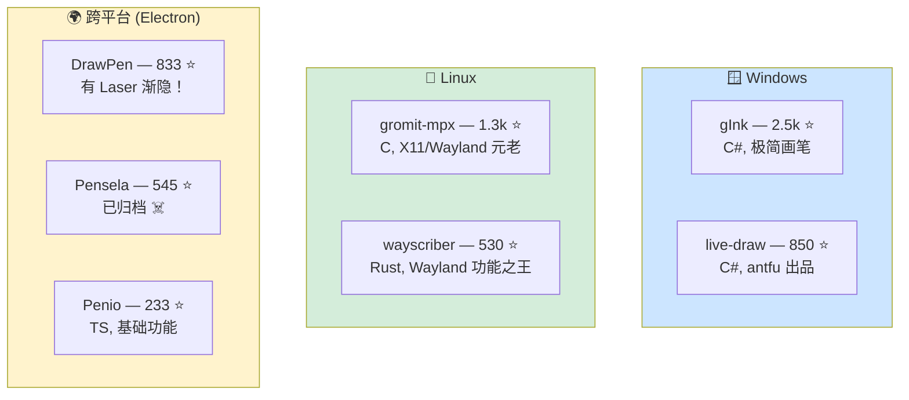
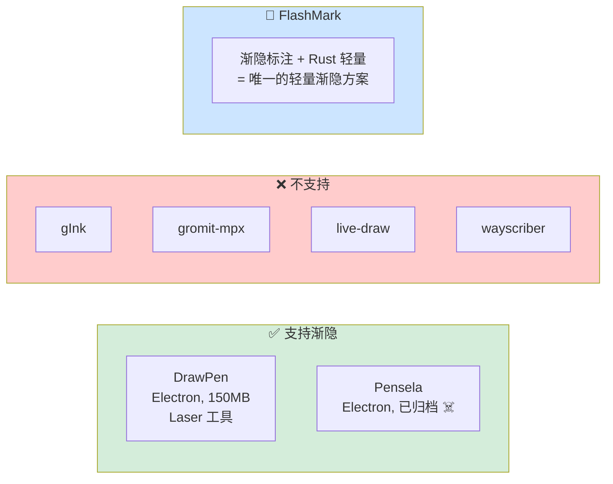

# 屏幕标注工具竞品调研

> 2026-04-16 | FlashMark 项目前期调研

## 开源竞品全景

## 各竞品详细功能

### 1. gInk（2,486 ⭐ · C# · Windows）

> **定位**：Epic Pen 的开源替代，极简屏幕画笔

**功能列表**：
- ✅ 自由画笔（墨迹绘制）
- ✅ 橡皮擦
- ✅ 多级撤销
- ✅ 截图到剪贴板 / 保存到文件
- ✅ 穿透点击模式（Click-through）
- ✅ 多显示器支持
- ✅ 笔压感应（触控笔/数位板）
- ✅ 系统托盘 + 全局热键
- ✅ 最多 5 支预设笔（独立颜色/透明度/笔宽）
- ✅ 平移墨迹（Pan）
- ✅ 临时隐藏墨迹
- ✅ 多语言支持（20+ 种）

**不支持**：箭头、矩形、椭圆、文字、渐隐、放大镜、序号标记

**技术**：C# + WinForms，Windows 透明窗口。免安装 zip，体积极小（~5MB）

**局限**：
- 不支持任何形状工具（作者推荐 fork 项目 ppInk 补充）
- 多显示器不同 DPI 时有已知问题
- 仅 Windows

---

### 2. gromit-mpx（1,317 ⭐ · C · Linux）

> **定位**：Linux 桌面的老牌屏幕标注工具

**功能列表**：
- ✅ 自由画笔（PEN）
- ✅ 平滑曲线工具（SMOOTH）
- ✅ 直线工具（LINE，可显示长度）
- ✅ 矩形（RECT）
- ✅ 圆形/椭圆（CIRCLE，支持填充和半透明填充）
- ✅ 箭头（通过 arrowsize/arrowtype 参数配置）
- ✅ 正交线段工具（ORTHOGONAL）
- ✅ 橡皮擦 + 重新着色工具
- ✅ 撤销/重做（最大 4 步）
- ✅ 完全可自定义工具配置文件
- ✅ 热键支持（F9 切换，F8 撤销，可自定义）
- ✅ 系统托盘
- ✅ 多指针支持（XInput2）
- ✅ 笔压感应
- ✅ 命令行控制已运行实例

**不支持**：文字标注、渐隐、截图、白板模式、放大镜、序号标记

**技术**：C + GTK，X11 COMPOSITE 扩展。Flatpak / 包管理器安装，体积极小

**局限**：
- 撤销深度仅 4 步
- Wayland 需 XWayland
- 仅 Linux

---

### 3. live-draw（850 ⭐ · C# · Windows）

> **定位**：Anthony Fu 出品的极简屏幕绘制工具

**功能列表**：
- ✅ 自由画笔
- ✅ 直线模式
- ✅ 按笔画擦除 / 按点擦除
- ✅ 无限撤销/重做
- ✅ 画笔大小 / 颜色调节
- ✅ 笔压感应
- ✅ 自动平滑墨迹
- ✅ Mini 模式（最小化界面）
- ✅ 保存/加载墨迹到文件
- ✅ 全动画界面

**不支持**：箭头、矩形、椭圆、文字、渐隐、截图、多屏幕

**技术**：C# + WPF，真透明背景窗口。需 .NET Core 5，体积小

**局限**：
- 仅画笔功能，无任何形状工具
- 仅 Windows
- 项目更新不活跃

---

### 4. DrawPen（833 ⭐ · Electron · 跨平台）

> **定位**：跨平台屏幕标注，功能均衡

**功能列表**：
- ✅ 自由画笔
- ✅ 形状工具（箭头/矩形等）
- ✅ 文字标注
- ✅ 荧光笔
- ✅ **激光笔（Laser）— 即渐隐标注！** ⭐
- ✅ 橡皮擦
- ✅ 颜色 / 粗细切换
- ✅ 白板模式
- ✅ 显示/隐藏工具栏
- ✅ 全局快捷键（Ctrl+Shift+A）
- ✅ 设置页面

**不支持**：撤销/重做、多屏幕、系统托盘、放大镜、序号标记、截图

**技术**：Electron，透明 BrowserWindow。Win/Mac/Linux 均可，但体积 ~80-150MB

**局限**：
- Electron 体积大
- Wayland 下可能崩溃
- 无撤销功能

---

### 5. Pensela（545 ⭐ · Electron · 跨平台 · ⚠️ 已归档）

> **定位**："屏幕标注瑞士军刀"

**功能列表**：
- ✅ 矩形、圆形、三角形、直线、自由画笔、多边形
- ✅ 贴纸/预制形状（星形、叉号、勾号、箭头）
- ✅ 荧光笔
- ✅ **激光笔（Laser Pointer）— 渐隐标注** ⭐
- ✅ 截图工具
- ✅ 文字标注
- ✅ 背景页面
- ✅ 自定义颜色选择器

**不支持**：撤销/重做、多屏幕、系统托盘、放大镜、序号标记

**技术**：Electron。体积大，已停止维护

---

### 6. wayscriber（530 ⭐ · Rust · Linux Wayland）

> **定位**：Linux/Wayland 的 ZoomIt 替代品，**功能最全面**

**功能列表**：
- ✅ 自由画笔、荧光笔、平滑曲线
- ✅ 直线、矩形、椭圆（支持填充切换）
- ✅ 箭头（支持自动编号标签！）
- ✅ **序号标记（Step markers）** ⭐
- ✅ 多行文字 & 便签（Sticky Notes）
- ✅ 选择/移动/复制/删除对象
- ✅ 橡皮擦（圆形/矩形）
- ✅ 颜色选择器 + 调色板 + 预设槽位
- ✅ 放射状菜单（中键呼出）
- ✅ 命名画板 + 透明/白板/黑板/自定义背景
- ✅ 截图（全屏/活动窗口/区域选择）
- ✅ **放大镜（ZoomIt 风格缩放）** ⭐
- ✅ 多显示器支持
- ✅ 系统托盘 + 守护进程模式
- ✅ 撤销/重做
- ✅ 命令面板（Ctrl+K）
- ✅ 演示者模式（隐藏 UI + 点击高亮）
- ✅ 屏幕冻结
- ✅ 数位板/触控笔支持
- ✅ 会话持久化（重启恢复）
- ✅ GUI 配置器

**不支持**：渐隐标注（仅有点击高亮是时间限定的）、聚光灯

**技术**：Rust + Cairo + smithay-client-toolkit，原生 Wayland layer-shell。体积小

**局限**：
- 仅 Linux/Wayland（不支持 X11、Windows、macOS）
- GNOME 下为窗口化回退模式

---

## 功能矩阵对比

| 功能 | gInk | gromit-mpx | live-draw | DrawPen | Pensela | wayscriber | **FlashMark** |
|------|:----:|:----------:|:---------:|:-------:|:-------:|:----------:|:-------------:|
| 自由画笔 | ✅ | ✅ | ✅ | ✅ | ✅ | ✅ | ✅ |
| 箭头 | ❌ | ✅ | ❌ | ✅ | ✅ | ✅ | ✅ |
| 矩形/椭圆 | ❌ | ✅ | ❌ | ✅ | ✅ | ✅ | ✅ |
| 文字标注 | ❌ | ❌ | ❌ | ✅ | ✅ | ✅ | P2 |
| **渐隐标注** | ❌ | ❌ | ❌ | ✅ | ✅ | ⚠️ | **✅ 核心** |
| 聚光灯 | ❌ | ❌ | ❌ | ❌ | ❌ | ❌ | P2 |
| 放大镜 | ❌ | ❌ | ❌ | ❌ | ❌ | ✅ | P1 |
| **序号标记** | ❌ | ❌ | ❌ | ❌ | ❌ | ✅ | **P1** |
| 撤销/重做 | ✅ | ✅(4步) | ✅(无限) | ❌ | ❌ | ✅ | ✅ |
| 多屏幕 | ✅ | ✅ | ❌ | ❌ | ❌ | ✅ | P2 |
| 系统托盘 | ✅ | ✅ | ❌ | ❌ | ❌ | ✅ | P1 |
| 快捷键自定义 | ✅ | ✅ | ❌ | ❌ | ❌ | ✅ | P2 |
| 白板模式 | ❌ | ❌ | ❌ | ✅ | ✅ | ✅ | P2 |
| 截图 | ✅ | ❌ | ❌ | ❌ | ✅ | ✅ | P2 |
| 橡皮擦 | ✅ | ✅ | ✅ | ✅ | ❌ | ✅ | ✅ |
| **跨平台** | ❌ Win | ❌ Linux | ❌ Win | ✅ | ✅ | ❌ Linux | **✅** |
| **体积** | ~5MB | 极小 | 小 | ~150MB | ~150MB | 小 | **~5MB** |
| **语言** | C# | C | C# | Electron | Electron | Rust | **Rust** |

## 关键发现

### 谁有渐隐标注？

**结论**：
1. 渐隐标注**不是零竞品**——DrawPen 和 Pensela 都有 Laser 工具
2. 但 DrawPen 是 Electron（150MB），Pensela 已归档
3. **FlashMark 的独特定位 = 渐隐标注 + Rust 轻量（~5MB）+ 跨平台**
4. 最全面的竞品是 wayscriber，但它只支持 Linux/Wayland
5. **macOS 开源标注工具依然几乎空白**

### FlashMark 的真正差异化

不只是"有渐隐"，而是：

| 差异点 | 对比 |
|--------|------|
| **渐隐 + 轻量** | DrawPen 有渐隐但 150MB，FlashMark ~5MB |
| **渐隐是默认行为** | DrawPen 的 Laser 是众多工具之一，FlashMark 以此为核心设计 |
| **Rust + 跨平台** | 目前没有任何 Rust 跨平台标注工具 |
| **序号标记 + 放大镜** | 在轻量工具中独有（只有重量级 wayscriber 有） |
