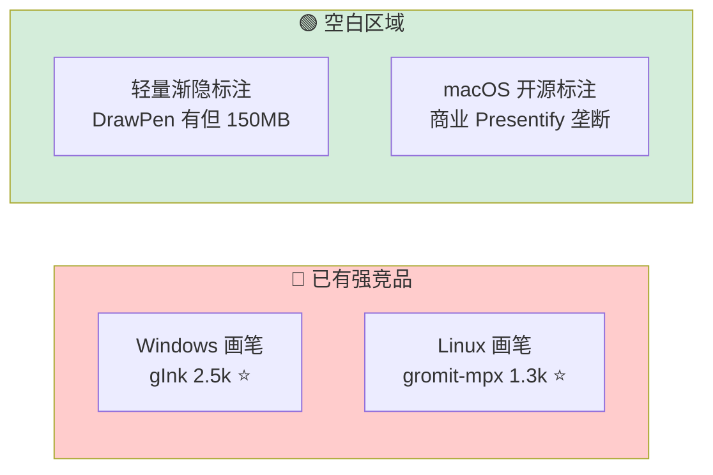
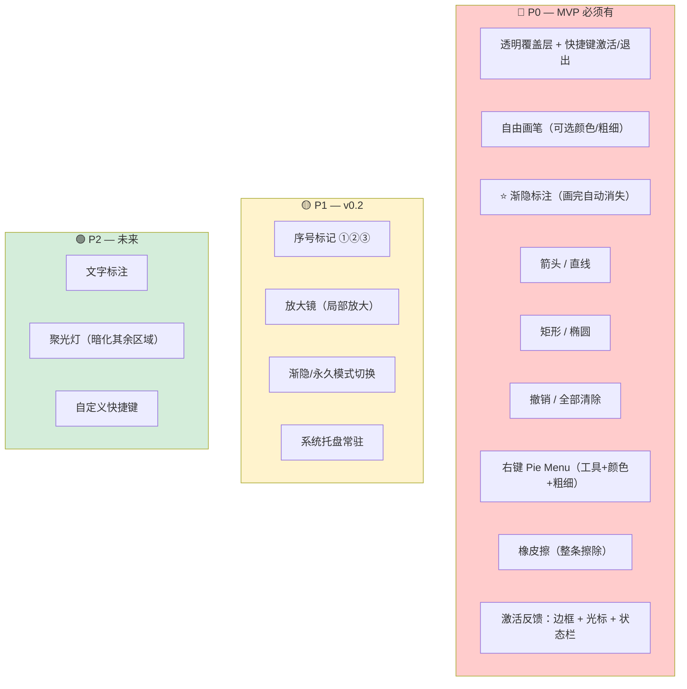
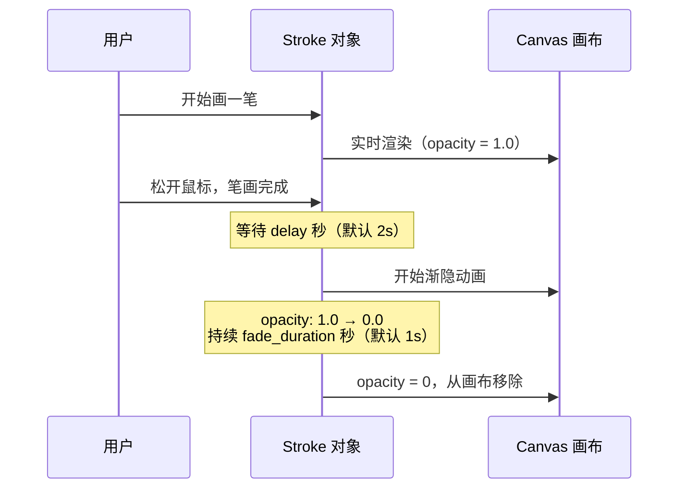
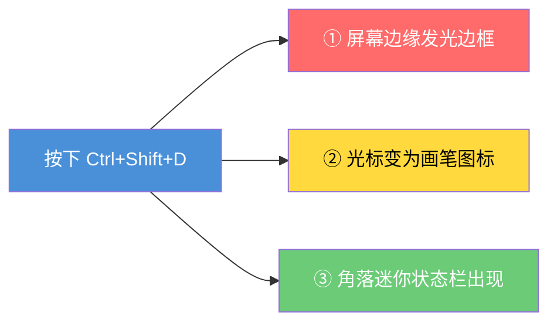
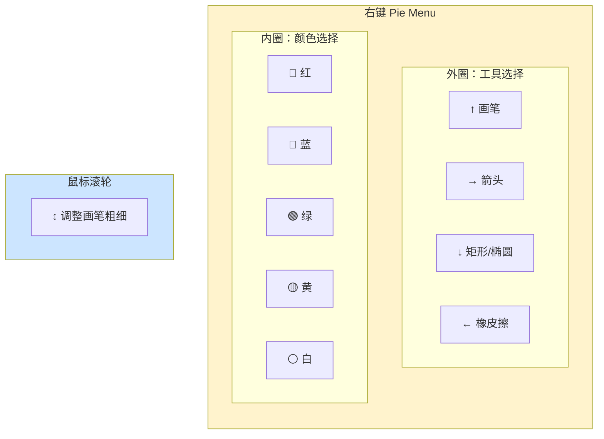
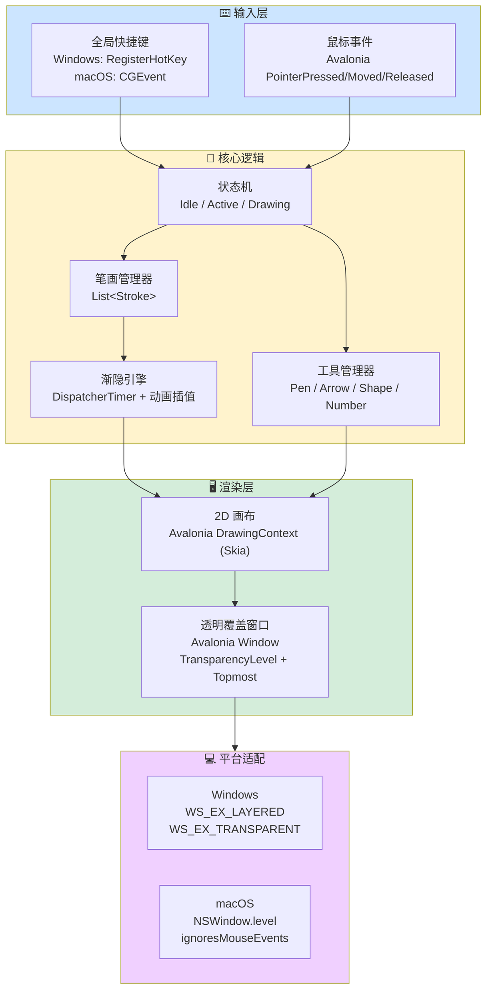
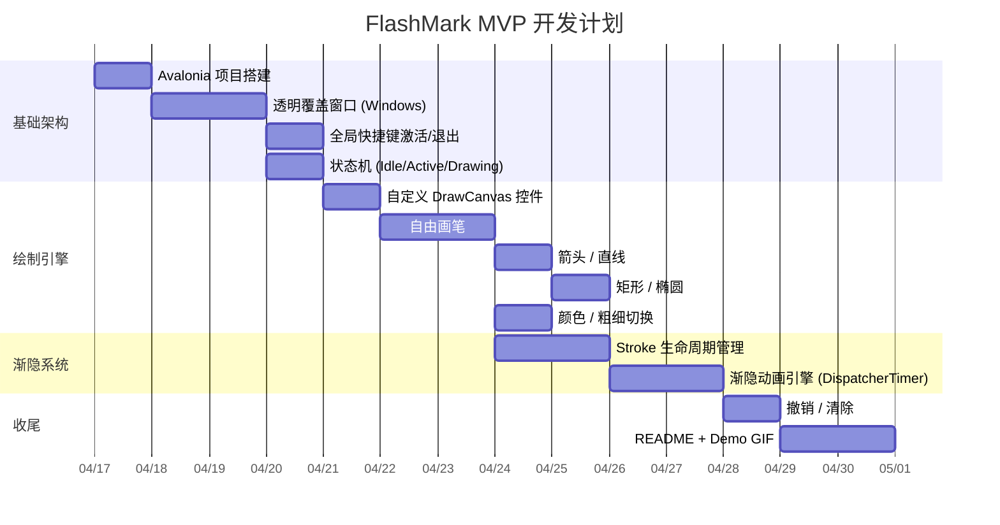

# FlashMark — 画完即隐的轻量屏幕标注工具

> 设计文档 | 2026-04-16（v3 — 补充交互细节 + .NET 10）

## 一句话定位

**一个用 C# + Avalonia 构建的 Windows/macOS 屏幕标注工具，核心卖点是"渐隐标注"——画完自动消失，专为远程会议和教学场景设计。**

**Slogan: "Draw. Fade. Focus."**

## 为什么做这个？

### 痛点

- 远程会议 share screen 时，想快速圈个重点、画个箭头给对方看，但**没有趁手的免费工具**
- 教学录屏时，标注完一步后要手动清除才能标注下一步，**打断节奏**
- 现有工具要么是 Windows 独占（gInk、ZoomIt），要么体积巨大（Electron 系 150MB+），要么已经不维护了
- **macOS 上几乎没有开源标注工具**，商业产品 Presentify 垄断

### 市场空白



### 竞品对比

| 特性 | gInk (2.5k⭐) | ZoomIt | Epic Pen ($25) | DrawPen (Electron) | **FlashMark** |
|------|:---:|:---:|:---:|:---:|:---:|
| 免费开源 | ✅ | 免费闭源 | ❌ | ✅ | ✅ |
| Windows | ✅ | ✅ | ✅ | ✅ | ✅ |
| **macOS** | ❌ | ❌ | ❌ | ✅ | **✅** |
| **渐隐标注** | ❌ | ❌ | ❌ | ✅ Laser | **✅ 核心体验** |
| 放大镜 | ❌ | ✅ | ❌ | ❌ | ✅ (P1) |
| 序号标记 | ❌ | ❌ | ❌ | ❌ | ✅ (P1) |
| 体积 | ~5MB | ~2MB | ~15MB | ~150MB | **~10-15MB** |
| 语言 | C# | C++ | ? | Electron/JS | **C#** |

## 目标平台

| 平台 | 优先级 | 理由 |
|------|--------|------|
| **Windows** | P0 | 主力开发平台，先出 MVP |
| **macOS** | P0 | 蓝海市场，开源标注几乎空白 |
| Linux | 不做 | 已有 gromit-mpx / wayscriber，不缺 |

## 目标用户

1. **远程会议主持人** — share screen 时快速标注重点
2. **老师/培训师** — 录教学视频时标注步骤
3. **开发者** — code review 时在屏幕上圈出问题位置
4. **内容创作者** — 录屏教程标注

## 核心功能

### 功能优先级



### 渐隐标注机制（核心卖点）



**每条笔画独立管理生命周期**：
- `delay`：画完后保持多久（默认 2 秒，可调 0-10 秒）
- `fade_duration`：渐隐动画时长（默认 1 秒，可调 0.5-3 秒）
- 可随时按快捷键切换为"永久模式"（标注不消失）

#### 三种渐隐风格（用户可选）

| 风格 | 效果 | 适用场景 |
|------|------|----------|
| **透明度渐变**（默认） | 笔画整体均匀变透明直到消失 | 通用，最不分散注意力 |
| **线性擦除** | 从笔画起点开始逐渐"溶解"到终点，像墨水被擦去 | 教学演示，有引导感 |
| **发光消散** | 笔画先变亮发光，然后快速消散 | 炫酷展示，科技感 |

### 激活与退出

#### 激活标注模式后的三重视觉反馈



1. **屏幕边缘发光边框**：淡红色发光边框提示"标注模式已激活"，不遮挡内容
2. **光标变为画笔图标**：直观告知当前可以画画
3. **角落迷你状态栏**：显示当前工具名 + 渐隐/永久模式

#### 退出行为

按 ESC 退出标注模式时：
- 边框和状态栏立即消失
- 光标恢复正常
- **已有的标注保留在屏幕上，自然渐隐完毕后消失**（不粗暴清屏）
- 永久模式的标注也保留，直到下次激活后手动清除

### 工具切换：右键 Pie Menu

**核心交互：右键弹出圆形菜单，一次操作完成工具/颜色/粗细选择。**



**操作流程**：
1. 右键按下 → Pie Menu 弹出
2. 鼠标滑向外圈方向 → 选择工具（高亮预览）
3. 或滑向内圈 → 选择颜色
4. 松开右键 → 确认选择，Pie Menu 消失
5. 任何时候滚轮 → 调整粗细（状态栏实时显示）

**Pie Menu 中的完整工具**：
- 画笔（自由画线）
- 箭头（直线箭头）
- 矩形
- 椭圆
- 橡皮擦（整条笔画擦除；局部像素级擦除 P2）
- 序号标记 ①②③（P1）
- 放大镜（P1）

### 序号标记交互（P1）

切换到序号工具后：
- 每点击屏幕一次，放置一个带圆圈的序号 ①②③...
- 自动递增，无需手动输入
- 切换到其他工具后序号计数器重置
- 渐隐模式下序号也会渐隐；永久模式下保留

### 迷你状态栏

位于屏幕右下角，半透明小浮窗：

```
┌─────────────────┐
│ ✏️ 画笔  渐隐 2s │
└─────────────────┘
```

只显示两个信息：
- **当前工具名**（画笔/箭头/矩形/椭圆/橡皮擦/序号）
- **当前模式**（渐隐 + 延迟秒数 / 永久）

### 快捷键

```
全局快捷键：
  Ctrl+Shift+D       → 激活/退出标注模式（macOS: Cmd+Shift+D）

标注模式内：
  ESC                 → 退出标注模式（标注保留自然渐隐）
  右键                → 弹出 Pie Menu（工具/颜色/粗细选择）
  鼠标滚轮            → 调整画笔粗细
  Ctrl+Z              → 撤销最后一笔
  Ctrl+Shift+Z        → 清除所有标注
  F                   → 切换渐隐/永久模式（P1）
```

**设计原则：右键 Pie Menu 为主要交互，快捷键为辅助。** 所有工具/颜色切换通过 Pie Menu 完成，不需要记忆大量快捷键。

## 技术架构

### 技术栈

| 组件 | 选型 | 理由 |
|------|------|------|
| 语言 | **C# (.NET 10)** | 最新 LTS，开发效率高，gInk/live-draw 已验证可行性 |
| UI 框架 | **Avalonia UI 11** | .NET 生态最成熟的跨平台 UI 框架，原生支持 Win + Mac |
| 2D 绘制 | **Avalonia 内置 Drawing API** (Skia 后端) | 基于 Skia 的高性能 2D 渲染，无需额外依赖 |
| 全局快捷键 | **平台原生 API** | Windows: RegisterHotKey / macOS: CGEvent |
| 系统托盘 | **Avalonia TrayIcon** | 框架内置支持 |
| 配置 | **JSON** | .NET 标准配置格式，System.Text.Json |
| 打包 | **NativeAOT** (可选) | 编译为原生二进制，无需 .NET Runtime |

### 为什么选 C# 而不是 Rust？

| 维度 | C# (.NET 10) | Rust |
|------|-------------|------|
| 体积 | ~10-15MB（自包含）/ ~5MB（NativeAOT） | ~3-8MB |
| 性能 | 画几条线完全够用 | 过剩，体现不出优势 |
| 开发速度 | **快 2-3 倍** | 学习曲线陡 |
| 跨平台 | ✅ Avalonia (Win+Mac) | ✅ 但 GUI 生态不如 .NET |
| 先例 | gInk 2.5k⭐ / live-draw 850⭐ | wayscriber 530⭐ (仅Linux) |

**结论**：这个项目的瓶颈是功能和体验，不是性能。C# 让我们更快做出好产品。

### 架构图



### 数据模型

```csharp
// 核心数据结构

public class Stroke
{
    public List<Point> Points { get; set; }    // 笔画路径点
    public ToolType Tool { get; set; }          // Pen / Arrow / Rect / Ellipse / Number
    public Color Color { get; set; }            // RGBA
    public double Width { get; set; }           // 线宽
    public double Opacity { get; set; }         // 当前透明度 0.0-1.0
    public DateTime CreatedAt { get; set; }     // 创建时间
    public FadeMode FadeMode { get; set; }      // Fading / Permanent
}

public record FadeConfig(int DelayMs = 2000, int DurationMs = 1000);

public enum FadeMode { Fading, Permanent }
public enum ToolType { Pen, Arrow, Line, Rect, Ellipse, Number }

public class AppState
{
    public AppMode Mode { get; set; }           // Idle / Active
    public List<Stroke> Strokes { get; set; }   // 所有笔画
    public ToolType CurrentTool { get; set; }   // 当前工具
    public Color CurrentColor { get; set; }     // 当前颜色
    public double CurrentWidth { get; set; }    // 当前线宽
    public FadeConfig FadeConfig { get; set; }  // 渐隐配置
}
```

### 跨平台透明窗口实现

这是技术上最关键的部分——创建一个覆盖全屏的透明窗口：

| 平台 | Avalonia 配置 | 平台特定补充 |
|------|---------------|-------------|
| **Windows** | `TransparencyLevelHint = Transparent` + `Topmost = true` | P/Invoke `SetWindowLong` 设置 `WS_EX_TRANSPARENT`（穿透点击） |
| **macOS** | 同上 Avalonia 配置 | `NSWindow.level = .screenSaver` + `ignoresMouseEvents`（穿透点击） |

**挑战点**：
- 标注模式下要捕获鼠标事件（画画），非标注模式下要穿透鼠标事件
- 需要处理多显示器场景（P2）
- macOS 的屏幕录制权限（Accessibility 权限）

## 文件结构

```
FlashMark/
├── FlashMark.sln
├── src/
│   └── FlashMark/
│       ├── FlashMark.csproj
│       ├── Program.cs               # 入口
│       ├── App.axaml / App.axaml.cs # Avalonia 应用
│       ├── ViewModels/
│       │   └── MainViewModel.cs     # 主窗口 ViewModel
│       ├── Views/
│       │   └── OverlayWindow.axaml  # 透明覆盖窗口
│       ├── Models/
│       │   ├── Stroke.cs            # 笔画数据
│       │   ├── AppState.cs          # 应用状态
│       │   └── FadeConfig.cs        # 渐隐配置
│       ├── Services/
│       │   ├── FadeEngine.cs        # 渐隐动画引擎
│       │   ├── HotkeyService.cs     # 全局快捷键（跨平台抽象）
│       │   └── ConfigService.cs     # 配置管理
│       ├── Controls/
│       │   └── DrawCanvas.cs        # 自定义绘制控件
│       ├── Tools/
│       │   ├── ITool.cs             # 工具接口
│       │   ├── PenTool.cs           # 自由画笔
│       │   ├── ArrowTool.cs         # 箭头
│       │   ├── ShapeTool.cs         # 矩形 / 椭圆
│       │   └── NumberTool.cs        # 序号标记（P1）
│       └── Platform/
│           ├── IPlatformHelper.cs   # 平台抽象接口
│           ├── WindowsHelper.cs     # Windows P/Invoke
│           └── MacHelper.cs         # macOS 原生调用
├── assets/
│   └── icon.png                     # 托盘图标
├── config.json.example              # 配置文件示例
└── README.md
```

## 配置文件

```json
{
  "hotkeys": {
    "toggle": "Ctrl+Shift+D"
  },
  "fade": {
    "enabled": true,
    "delayMs": 2000,
    "durationMs": 1000,
    "style": "opacity"
  },
  "pen": {
    "defaultColor": "#FF4444",
    "defaultWidth": 3.0
  },
  "colors": {
    "palette": ["#FF4444", "#4488FF", "#44BB44", "#FFBB33", "#FFFFFF"]
  }
}
```

> `fade.style` 可选值：`"opacity"`（透明度渐变）、`"wipe"`（线性擦除）、`"glow"`（发光消散）

## 实现路线图

### Phase 1 — MVP（~2 周）



**MVP 交付物**：Windows 上可用的屏幕标注工具，支持画笔/箭头/形状 + 渐隐效果。

### Phase 2 — 功能增强 + macOS（~2 周）

- macOS 适配（透明窗口 + Accessibility 权限）
- 序号标记 ①②③
- 放大镜
- 渐隐/永久模式快捷键切换
- 系统托盘常驻
- 配置文件支持

### Phase 3 — 打磨（~1 周）

- 文字标注
- 聚光灯（暗化其余区域）
- 自定义快捷键
- CI/CD 自动构建 Win + Mac 安装包
- Homebrew / WinGet 发布

## Demo 展示方案

**GitHub README 上放一个 GIF**，展示核心体验：

```
[GIF 内容]
1. 按 Ctrl+Shift+D 激活
2. 用红色画笔圈住一段代码
3. 标注 2 秒后开始优雅渐隐
4. 用箭头指向另一个位置
5. 箭头也自动渐隐
6. 按 ESC 退出

旁白文字叠加：
"FlashMark — Draw. Fade. Focus."
```

## 项目命名

**FlashMark** — Flash（闪现）+ Mark（标记）

含义：标注像闪电一样出现，又优雅地消失。也暗示了"快速标记"的使用方式。
