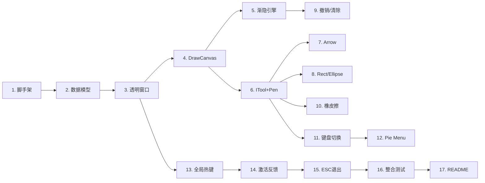

# FlashMark MVP 实现计划

> **For Claude:** REQUIRED SUB-SKILL: Use superpowers:executing-plans to implement this plan task-by-task.

**Goal:** 构建 FlashMark P0 MVP — Windows 上可用的屏幕标注工具，支持画笔/箭头/矩形/椭圆 + 渐隐效果 + Pie Menu + 橡皮擦 + 激活反馈。

**Architecture:** Avalonia UI 11 透明覆盖窗口 + 自定义 DrawCanvas (Skia) + DispatcherTimer 驱动的渐隐引擎。状态机管理 Idle/Active/Drawing 模式，ITool 接口实现各种绘制工具，右键 Pie Menu 做工具/颜色切换。

**Tech Stack:** C# / .NET 10 / Avalonia UI 11 / Skia (via Avalonia)

---

### Task 1: 项目脚手架搭建

**Files:**
- Create: `flashmark/src/FlashMark/FlashMark.csproj`
- Create: `flashmark/src/FlashMark/Program.cs`
- Create: `flashmark/src/FlashMark/App.axaml`
- Create: `flashmark/src/FlashMark/App.axaml.cs`
- Create: `flashmark/FlashMark.sln`

**Step 1: 用 dotnet 创建 Avalonia 项目**

```bash
cd d:/dev/cc/flashmark
dotnet new install Avalonia.Templates
dotnet new avalonia.app -n FlashMark -o src/FlashMark
dotnet new sln -n FlashMark
dotnet sln add src/FlashMark/FlashMark.csproj
```

**Step 2: 验证项目能编译**

Run: `cd d:/dev/cc/flashmark && dotnet build`
Expected: Build succeeded

**Step 3: 验证项目能运行**

Run: `cd d:/dev/cc/flashmark && dotnet run --project src/FlashMark`
Expected: 弹出一个 Avalonia 默认窗口，手动关闭

**Step 4: Commit**

```bash
git init
git add -A
git commit -m "feat: init Avalonia project scaffold"
```

---

### Task 2: 数据模型 — Stroke, AppState, Enums

**Files:**
- Create: `src/FlashMark/Models/ToolType.cs`
- Create: `src/FlashMark/Models/FadeMode.cs`
- Create: `src/FlashMark/Models/FadeConfig.cs`
- Create: `src/FlashMark/Models/Stroke.cs`
- Create: `src/FlashMark/Models/AppState.cs`

**Step 1: 创建枚举和配置记录**

```csharp
// Models/ToolType.cs
namespace FlashMark.Models;

public enum ToolType { Pen, Arrow, Line, Rect, Ellipse }

// Models/FadeMode.cs
namespace FlashMark.Models;

public enum FadeMode { Fading, Permanent }

// Models/FadeConfig.cs
namespace FlashMark.Models;

public record FadeConfig(int DelayMs = 2000, int DurationMs = 1000);
```

**Step 2: 创建 Stroke 类**

```csharp
// Models/Stroke.cs
namespace FlashMark.Models;

using Avalonia;
using Avalonia.Media;

public class Stroke
{
    public List<Point> Points { get; set; } = new();
    public ToolType Tool { get; set; }
    public Color Color { get; set; } = Colors.Red;
    public double Width { get; set; } = 3.0;
    public double Opacity { get; set; } = 1.0;
    public DateTime CreatedAt { get; set; } = DateTime.Now;
    public FadeMode FadeMode { get; set; } = FadeMode.Fading;
    public bool IsComplete { get; set; }
}
```

**Step 3: 创建 AppState 类**

```csharp
// Models/AppState.cs
namespace FlashMark.Models;

using Avalonia.Media;
using System.ComponentModel;
using System.Runtime.CompilerServices;

public class AppState : INotifyPropertyChanged
{
    private bool _isActive;
    private ToolType _currentTool = ToolType.Pen;
    private Color _currentColor = Colors.Red;
    private double _currentWidth = 3.0;
    private FadeMode _fadeMode = FadeMode.Fading;

    public bool IsActive
    {
        get => _isActive;
        set { _isActive = value; OnPropertyChanged(); }
    }

    public ToolType CurrentTool
    {
        get => _currentTool;
        set { _currentTool = value; OnPropertyChanged(); }
    }

    public Color CurrentColor
    {
        get => _currentColor;
        set { _currentColor = value; OnPropertyChanged(); }
    }

    public double CurrentWidth
    {
        get => _currentWidth;
        set { _currentWidth = value; OnPropertyChanged(); }
    }

    public FadeMode FadeMode
    {
        get => _fadeMode;
        set { _fadeMode = value; OnPropertyChanged(); }
    }

    public List<Stroke> Strokes { get; } = new();
    public FadeConfig FadeConfig { get; set; } = new();

    public event PropertyChangedEventHandler? PropertyChanged;
    protected void OnPropertyChanged([CallerMemberName] string? name = null)
        => PropertyChanged?.Invoke(this, new PropertyChangedEventArgs(name));
}
```

**Step 4: 验证编译**

Run: `dotnet build`
Expected: Build succeeded

**Step 5: Commit**

```bash
git add src/FlashMark/Models/
git commit -m "feat: add data models — Stroke, AppState, enums"
```

---

### Task 3: 透明覆盖窗口

**Files:**
- Create: `src/FlashMark/Views/OverlayWindow.axaml`
- Create: `src/FlashMark/Views/OverlayWindow.axaml.cs`
- Modify: `src/FlashMark/App.axaml.cs` — 改为启动 OverlayWindow

**Step 1: 创建 OverlayWindow AXAML**

```xml
<!-- Views/OverlayWindow.axaml -->
<Window xmlns="https://github.com/avaloniaui"
        xmlns:x="http://schemas.microsoft.com/winfx/2006/xaml"
        x:Class="FlashMark.Views.OverlayWindow"
        Title="FlashMark"
        SystemDecorations="None"
        Background="Transparent"
        TransparencyLevelHint="Transparent"
        Topmost="True"
        WindowState="Maximized"
        ShowInTaskbar="False">
</Window>
```

**Step 2: 创建 OverlayWindow code-behind**

```csharp
// Views/OverlayWindow.axaml.cs
using Avalonia.Controls;
using Avalonia.Input;

namespace FlashMark.Views;

public partial class OverlayWindow : Window
{
    public OverlayWindow()
    {
        InitializeComponent();
    }
}
```

**Step 3: 修改 App.axaml.cs 启动 OverlayWindow**

修改 `OnFrameworkInitializationCompleted` 使用 `OverlayWindow` 替代默认 `MainWindow`。

**Step 4: 运行验证透明窗口**

Run: `dotnet run --project src/FlashMark`
Expected: 全屏透明窗口覆盖桌面，可以看到背后的内容。按 Alt+F4 关闭。

**Step 5: Commit**

```bash
git add src/FlashMark/Views/ src/FlashMark/App.axaml.cs
git commit -m "feat: add transparent overlay window"
```

---

### Task 4: 自定义 DrawCanvas 控件 — 基础绘制

**Files:**
- Create: `src/FlashMark/Controls/DrawCanvas.cs`
- Modify: `src/FlashMark/Views/OverlayWindow.axaml` — 嵌入 DrawCanvas

**Step 1: 创建 DrawCanvas 控件**

```csharp
// Controls/DrawCanvas.cs
using Avalonia;
using Avalonia.Controls;
using Avalonia.Input;
using Avalonia.Media;
using FlashMark.Models;

namespace FlashMark.Controls;

public class DrawCanvas : Control
{
    private readonly AppState _state;
    private Stroke? _currentStroke;

    public DrawCanvas()
    {
        _state = new AppState { IsActive = true };
        ClipToBounds = true;
    }

    public AppState State => _state;

    protected override void OnPointerPressed(PointerPressedEventArgs e)
    {
        base.OnPointerPressed(e);
        if (e.GetCurrentPoint(this).Properties.IsLeftButtonPressed && _state.IsActive)
        {
            _currentStroke = new Stroke
            {
                Tool = _state.CurrentTool,
                Color = _state.CurrentColor,
                Width = _state.CurrentWidth,
                FadeMode = _state.FadeMode
            };
            _currentStroke.Points.Add(e.GetPosition(this));
            _state.Strokes.Add(_currentStroke);
            e.Handled = true;
            InvalidateVisual();
        }
    }

    protected override void OnPointerMoved(PointerEventArgs e)
    {
        base.OnPointerMoved(e);
        if (_currentStroke != null)
        {
            _currentStroke.Points.Add(e.GetPosition(this));
            InvalidateVisual();
        }
    }

    protected override void OnPointerReleased(PointerReleasedEventArgs e)
    {
        base.OnPointerReleased(e);
        if (_currentStroke != null)
        {
            _currentStroke.IsComplete = true;
            _currentStroke = null;
            InvalidateVisual();
        }
    }

    public override void Render(DrawingContext context)
    {
        base.Render(context);
        foreach (var stroke in _state.Strokes)
        {
            if (stroke.Points.Count < 2) continue;
            var pen = new Pen(new SolidColorBrush(stroke.Color, stroke.Opacity), stroke.Width,
                lineCap: PenLineCap.Round, lineJoin: PenLineJoin.Round);

            for (int i = 1; i < stroke.Points.Count; i++)
            {
                context.DrawLine(pen, stroke.Points[i - 1], stroke.Points[i]);
            }
        }
    }
}
```

**Step 2: 在 OverlayWindow 中嵌入 DrawCanvas**

在 OverlayWindow.axaml 中添加 `<controls:DrawCanvas />` 并注册 namespace。

**Step 3: 运行验证可以画线**

Run: `dotnet run --project src/FlashMark`
Expected: 在透明窗口上按住左键拖动可以画红色线条

**Step 4: Commit**

```bash
git add src/FlashMark/Controls/ src/FlashMark/Views/
git commit -m "feat: add DrawCanvas with basic freehand drawing"
```

---

### Task 5: 渐隐引擎

**Files:**
- Create: `src/FlashMark/Services/FadeEngine.cs`
- Modify: `src/FlashMark/Controls/DrawCanvas.cs` — 集成 FadeEngine

**Step 1: 创建 FadeEngine**

```csharp
// Services/FadeEngine.cs
using Avalonia.Threading;
using FlashMark.Models;

namespace FlashMark.Services;

public class FadeEngine
{
    private readonly AppState _state;
    private readonly Action _invalidate;
    private DispatcherTimer? _timer;

    public FadeEngine(AppState state, Action invalidate)
    {
        _state = state;
        _invalidate = invalidate;
    }

    public void Start()
    {
        _timer = new DispatcherTimer { Interval = TimeSpan.FromMilliseconds(16) }; // ~60fps
        _timer.Tick += OnTick;
        _timer.Start();
    }

    public void Stop() => _timer?.Stop();

    private void OnTick(object? sender, EventArgs e)
    {
        var now = DateTime.Now;
        bool needsRedraw = false;
        var config = _state.FadeConfig;

        for (int i = _state.Strokes.Count - 1; i >= 0; i--)
        {
            var stroke = _state.Strokes[i];
            if (!stroke.IsComplete || stroke.FadeMode == FadeMode.Permanent) continue;

            var elapsed = (now - stroke.CreatedAt).TotalMilliseconds;
            if (elapsed < config.DelayMs) continue;

            var fadeElapsed = elapsed - config.DelayMs;
            if (fadeElapsed >= config.DurationMs)
            {
                _state.Strokes.RemoveAt(i);
                needsRedraw = true;
            }
            else
            {
                var newOpacity = 1.0 - (fadeElapsed / config.DurationMs);
                if (Math.Abs(stroke.Opacity - newOpacity) > 0.01)
                {
                    stroke.Opacity = newOpacity;
                    needsRedraw = true;
                }
            }
        }

        if (needsRedraw) _invalidate();
    }
}
```

**Step 2: 在 DrawCanvas 中集成 FadeEngine**

在 DrawCanvas 构造函数中创建 `FadeEngine` 并在 `AttachedToVisualTree` 时 Start。

**Step 3: 运行验证渐隐效果**

Run: `dotnet run --project src/FlashMark`
Expected: 画一条线后 2 秒开始渐隐，1 秒内完全消失

**Step 4: Commit**

```bash
git add src/FlashMark/Services/FadeEngine.cs src/FlashMark/Controls/DrawCanvas.cs
git commit -m "feat: add fade engine — strokes auto-fade after delay"
```

---

### Task 6: 工具系统 — ITool + PenTool

**Files:**
- Create: `src/FlashMark/Tools/ITool.cs`
- Create: `src/FlashMark/Tools/PenTool.cs`
- Modify: `src/FlashMark/Controls/DrawCanvas.cs` — 使用 ITool

**Step 1: 创建 ITool 接口**

```csharp
// Tools/ITool.cs
using Avalonia;
using Avalonia.Media;
using FlashMark.Models;

namespace FlashMark.Tools;

public interface ITool
{
    ToolType Type { get; }
    void OnPointerPressed(Point position, Stroke stroke);
    void OnPointerMoved(Point position, Stroke stroke);
    void OnPointerReleased(Point position, Stroke stroke);
    void Render(DrawingContext context, Stroke stroke);
}
```

**Step 2: 创建 PenTool**

```csharp
// Tools/PenTool.cs
using Avalonia;
using Avalonia.Media;
using FlashMark.Models;

namespace FlashMark.Tools;

public class PenTool : ITool
{
    public ToolType Type => ToolType.Pen;

    public void OnPointerPressed(Point position, Stroke stroke)
        => stroke.Points.Add(position);

    public void OnPointerMoved(Point position, Stroke stroke)
        => stroke.Points.Add(position);

    public void OnPointerReleased(Point position, Stroke stroke)
        => stroke.IsComplete = true;

    public void Render(DrawingContext context, Stroke stroke)
    {
        if (stroke.Points.Count < 2) return;
        var pen = new Pen(new SolidColorBrush(stroke.Color, stroke.Opacity), stroke.Width,
            lineCap: PenLineCap.Round, lineJoin: PenLineJoin.Round);
        for (int i = 1; i < stroke.Points.Count; i++)
            context.DrawLine(pen, stroke.Points[i - 1], stroke.Points[i]);
    }
}
```

**Step 3: 重构 DrawCanvas 使用 ITool**

DrawCanvas 内维护 `Dictionary<ToolType, ITool>`，在 `Render` 中根据 `stroke.Tool` 调用对应工具的 `Render`。

**Step 4: 验证编译并运行画笔功能不变**

Run: `dotnet build && dotnet run --project src/FlashMark`
Expected: 画笔功能和之前完全一样

**Step 5: Commit**

```bash
git add src/FlashMark/Tools/ src/FlashMark/Controls/DrawCanvas.cs
git commit -m "feat: add ITool abstraction + PenTool"
```

---

### Task 7: ArrowTool + LineTool

**Files:**
- Create: `src/FlashMark/Tools/ArrowTool.cs`
- Modify: `src/FlashMark/Controls/DrawCanvas.cs` — 注册 ArrowTool

**Step 1: 创建 ArrowTool**

箭头工具：按下记录起点，拖动时预览，松开确定终点。渲染时在终点画三角箭头头。

```csharp
// Tools/ArrowTool.cs — 用 Points[0] 作为起点，Points[^1] 作为终点
// 渲染：直线 + 箭头三角形
// OnPointerMoved 时替换 Points[^1]（保持只有 2 个点）
```

**Step 2: 注册到 DrawCanvas**

**Step 3: 运行验证箭头**

Run: `dotnet run --project src/FlashMark`
Expected: 可以画出带箭头的线段（需要临时切换工具，暂时硬编码或用键盘快捷键切换）

**Step 4: Commit**

```bash
git add src/FlashMark/Tools/ArrowTool.cs src/FlashMark/Controls/DrawCanvas.cs
git commit -m "feat: add arrow tool"
```

---

### Task 8: ShapeTool — 矩形 + 椭圆

**Files:**
- Create: `src/FlashMark/Tools/ShapeTool.cs`
- Modify: `src/FlashMark/Controls/DrawCanvas.cs` — 注册 ShapeTool

**Step 1: 创建 ShapeTool**

按下记录一角，拖动预览矩形/椭圆，松开确定。`ToolType.Rect` 画矩形，`ToolType.Ellipse` 画椭圆。

```csharp
// Tools/ShapeTool.cs
// Points[0] = 起始角, Points[1] = 对角
// Render: 根据 stroke.Tool 决定画 DrawRectangle 还是 DrawEllipse
// 使用 stroke 的 Color 和 Width, 不填充（只描边）
```

**Step 2: 注册 Rect 和 Ellipse 到 DrawCanvas**

**Step 3: 运行验证矩形和椭圆**

Run: `dotnet run --project src/FlashMark`
Expected: 可以画矩形和椭圆框

**Step 4: Commit**

```bash
git add src/FlashMark/Tools/ShapeTool.cs src/FlashMark/Controls/DrawCanvas.cs
git commit -m "feat: add rect and ellipse shape tools"
```

---

### Task 9: 撤销 + 全部清除

**Files:**
- Modify: `src/FlashMark/Models/AppState.cs` — 添加 Undo/Clear 方法
- Modify: `src/FlashMark/Controls/DrawCanvas.cs` — 绑定键盘事件

**Step 1: 在 AppState 中添加撤销和清除**

```csharp
// AppState 添加:
public void Undo()
{
    if (Strokes.Count > 0)
        Strokes.RemoveAt(Strokes.Count - 1);
}

public void ClearAll() => Strokes.Clear();
```

**Step 2: 在 DrawCanvas 中监听键盘**

```csharp
// OnKeyDown:
// Ctrl+Z → Undo
// Ctrl+Shift+Z → ClearAll
```

**Step 3: 运行验证撤销**

Run: `dotnet run --project src/FlashMark`
Expected: Ctrl+Z 移除最后一笔，Ctrl+Shift+Z 清除全部

**Step 4: Commit**

```bash
git add src/FlashMark/Models/AppState.cs src/FlashMark/Controls/DrawCanvas.cs
git commit -m "feat: add undo (Ctrl+Z) and clear all (Ctrl+Shift+Z)"
```

---

### Task 10: 橡皮擦工具（整条擦除）

**Files:**
- Create: `src/FlashMark/Tools/EraserTool.cs`
- Modify: `src/FlashMark/Controls/DrawCanvas.cs` — 注册 EraserTool

**Step 1: 创建 EraserTool**

```csharp
// Tools/EraserTool.cs
// 橡皮擦不创建 Stroke，而是在 OnPointerPressed/Moved 时
// 检测鼠标位置附近的 Stroke 并移除
// 使用简单的距离检测：遍历每个 stroke 的每个点，
// 如果鼠标距离某个点 < threshold (如 15px)，移除整条 stroke
```

**Step 2: 注册到 DrawCanvas**

需要特殊处理：EraserTool 不走常规的"创建新 Stroke"流程。在 DrawCanvas 的 PointerPressed 中判断当前工具是否为 Eraser，走不同分支。

**Step 3: 运行验证橡皮擦**

Run: `dotnet run --project src/FlashMark`
Expected: 切换到橡皮擦后，点击/拖过笔画可以整条删除

**Step 4: Commit**

```bash
git add src/FlashMark/Tools/EraserTool.cs src/FlashMark/Controls/DrawCanvas.cs
git commit -m "feat: add eraser tool (whole-stroke removal)"
```

---

### Task 11: 临时键盘快捷键切换工具（Pie Menu 前的过渡方案）

**Files:**
- Modify: `src/FlashMark/Controls/DrawCanvas.cs` — 添加数字键切换

**Step 1: 添加键盘工具切换**

```csharp
// OnKeyDown 中:
// 1 → Pen, 2 → Arrow, 3 → Rect, 4 → Ellipse, 5 → Eraser
// 颜色: Q → Red, W → Blue, E → Green, R → Yellow, T → White
// 滚轮: 调整粗细 (1-20, step 1)
```

**Step 2: 运行验证所有工具可切换**

Run: `dotnet run --project src/FlashMark`
Expected: 按数字键切换工具，用滚轮调粗细

**Step 3: Commit**

```bash
git add src/FlashMark/Controls/DrawCanvas.cs
git commit -m "feat: add keyboard shortcuts for tool/color switching"
```

---

### Task 12: 右键 Pie Menu

**Files:**
- Create: `src/FlashMark/Controls/PieMenu.cs`
- Modify: `src/FlashMark/Controls/DrawCanvas.cs` — 集成 PieMenu

**Step 1: 创建 PieMenu 控件**

```csharp
// Controls/PieMenu.cs
// 自定义 Control，Override Render 绘制:
// - 外圈: 工具选择（上=画笔, 右=箭头, 下=矩形/椭圆, 左=橡皮擦）
// - 内圈: 颜色选择（5 个扇区对应 5 种颜色）
// - 中心: 当前工具图标
//
// 交互:
// - 右键按下 → 显示 PieMenu (以鼠标位置为圆心)
// - 鼠标移动 → 高亮对应扇区
// - 右键松开 → 确认选择, 隐藏 PieMenu
//
// 尺寸: 外圈半径 ~100px, 内圈半径 ~50px
// 高亮: 被选中扇区亮度增加
```

**Step 2: 在 DrawCanvas 中集成**

右键按下时创建/显示 PieMenu，右键松开时读取选择结果并隐藏。

**Step 3: 运行验证 Pie Menu**

Run: `dotnet run --project src/FlashMark`
Expected: 右键弹出圆形菜单，移动鼠标高亮不同选项，松开选中

**Step 4: Commit**

```bash
git add src/FlashMark/Controls/PieMenu.cs src/FlashMark/Controls/DrawCanvas.cs
git commit -m "feat: add right-click Pie Menu for tool/color selection"
```

---

### Task 13: 全局快捷键（Windows）

**Files:**
- Create: `src/FlashMark/Platform/IPlatformHelper.cs`
- Create: `src/FlashMark/Platform/WindowsHelper.cs`
- Create: `src/FlashMark/Services/HotkeyService.cs`
- Modify: `src/FlashMark/Views/OverlayWindow.axaml.cs` — 集成快捷键

**Step 1: 创建平台抽象接口**

```csharp
// Platform/IPlatformHelper.cs
namespace FlashMark.Platform;

public interface IPlatformHelper
{
    void RegisterHotkey(int id, uint modifiers, uint key, Action callback);
    void UnregisterHotkey(int id);
    void SetClickThrough(nint handle, bool enable);
}
```

**Step 2: 创建 Windows 实现**

```csharp
// Platform/WindowsHelper.cs
// 使用 P/Invoke:
// [DllImport("user32.dll")] RegisterHotKey
// [DllImport("user32.dll")] UnregisterHotKey
// [DllImport("user32.dll")] SetWindowLong / GetWindowLong (WS_EX_TRANSPARENT)
// 注册 Ctrl+Shift+D 作为全局热键
```

**Step 3: 创建 HotkeyService**

根据 `RuntimeInformation.IsOSPlatform` 选择平台实现。

**Step 4: 在 OverlayWindow 中集成**

按 Ctrl+Shift+D 切换 IsActive 状态。IsActive=false 时窗口设置点击穿透，IsActive=true 时捕获鼠标。

**Step 5: 运行验证**

Run: `dotnet run --project src/FlashMark`
Expected: Ctrl+Shift+D 切换标注模式，非标注模式可以正常点击下方窗口

**Step 6: Commit**

```bash
git add src/FlashMark/Platform/ src/FlashMark/Services/HotkeyService.cs src/FlashMark/Views/
git commit -m "feat: add global hotkey (Ctrl+Shift+D) and click-through toggle"
```

---

### Task 14: 激活反馈 — 边框发光 + 光标 + 状态栏

**Files:**
- Create: `src/FlashMark/Controls/StatusBar.cs`
- Create: `src/FlashMark/Controls/BorderGlow.cs`
- Modify: `src/FlashMark/Views/OverlayWindow.axaml` — 添加边框和状态栏
- Modify: `src/FlashMark/Views/OverlayWindow.axaml.cs` — 管理激活反馈

**Step 1: 创建 BorderGlow 控件**

```csharp
// Controls/BorderGlow.cs
// 自定义 Control，Render 时在窗口四边画半透明红色发光边框
// 使用渐变画刷 (LinearGradientBrush) 从红色到透明
// 边框宽度 ~4px, 颜色 #FF4444 with opacity 0.6
// IsVisible 绑定到 AppState.IsActive
```

**Step 2: 创建 StatusBar 控件**

```csharp
// Controls/StatusBar.cs
// 右下角小浮窗，显示:
// - 当前工具名（画笔/箭头/矩形/椭圆/橡皮擦）
// - 当前模式（渐隐 2s / 永久）
// 半透明背景 #000000 opacity 0.5, 圆角 8px
// 字体白色 14px
// IsVisible 绑定到 AppState.IsActive
```

**Step 3: 光标切换**

在 OverlayWindow 中，IsActive 变化时设置 `Cursor = new Cursor(StandardCursorType.Cross)` (激活) 或 `Cursor = Cursor.Default` (退出)。

**Step 4: 在 OverlayWindow 中组装**

```xml
<!-- OverlayWindow.axaml -->
<Panel>
    <controls:BorderGlow />
    <controls:DrawCanvas />
    <controls:StatusBar HorizontalAlignment="Right" VerticalAlignment="Bottom" Margin="0,0,20,20" />
</Panel>
```

**Step 5: 运行验证激活反馈**

Run: `dotnet run --project src/FlashMark`
Expected: Ctrl+Shift+D 激活后看到红色边框、十字光标、右下角状态栏

**Step 6: Commit**

```bash
git add src/FlashMark/Controls/ src/FlashMark/Views/
git commit -m "feat: add activation feedback — border glow, cursor, status bar"
```

---

### Task 15: ESC 退出 + 标注保留渐隐

**Files:**
- Modify: `src/FlashMark/Views/OverlayWindow.axaml.cs` — ESC 处理
- Modify: `src/FlashMark/Controls/DrawCanvas.cs` — ESC 退出逻辑

**Step 1: 实现 ESC 退出行为**

```csharp
// ESC 按下时:
// 1. AppState.IsActive = false
// 2. 边框和状态栏消失
// 3. 光标恢复
// 4. 窗口设置点击穿透
// 5. 已有笔画 NOT 清除，FadeEngine 继续运行直到全部渐隐完毕
// 6. 当所有 Strokes 消失后，FadeEngine 自动暂停节省 CPU
```

**Step 2: 运行验证**

Run: `dotnet run --project src/FlashMark`
Expected: 画几笔后按 ESC，标注继续渐隐，可以正常点击下方窗口

**Step 3: Commit**

```bash
git add src/FlashMark/Views/ src/FlashMark/Controls/
git commit -m "feat: ESC exits annotation mode, strokes fade naturally"
```

---

### Task 16: 整合测试 + 打磨

**Files:**
- 可能微调以上各文件

**Step 1: 完整功能测试清单**

手动测试以下场景：
- [ ] Ctrl+Shift+D 激活，看到三重反馈
- [ ] 画笔画线，2s 后渐隐
- [ ] 右键 Pie Menu 切换到箭头，画箭头
- [ ] Pie Menu 切换颜色到蓝色
- [ ] 滚轮调粗细
- [ ] 画矩形、椭圆
- [ ] Ctrl+Z 撤销
- [ ] Ctrl+Shift+Z 全部清除
- [ ] 橡皮擦整条删除
- [ ] ESC 退出，标注保留渐隐
- [ ] Ctrl+Shift+D 再次激活
- [ ] 下方窗口在非激活时可正常点击

**Step 2: 修复发现的问题**

**Step 3: Commit**

```bash
git add -A
git commit -m "fix: integration testing polish"
```

---

### Task 17: README + .gitignore

**Files:**
- Create: `flashmark/README.md`
- Create: `flashmark/.gitignore`

**Step 1: 创建 .gitignore**

```
bin/
obj/
.vs/
*.user
*.suo
```

**Step 2: 创建 README**

简要介绍 FlashMark，包含：项目名和 Slogan、功能列表、截图占位、构建运行命令、License。

**Step 3: Commit**

```bash
git add README.md .gitignore
git commit -m "docs: add README and .gitignore"
```

---

## 总任务数：17 个 Task


